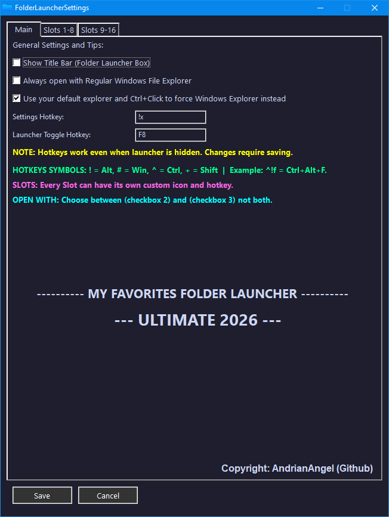
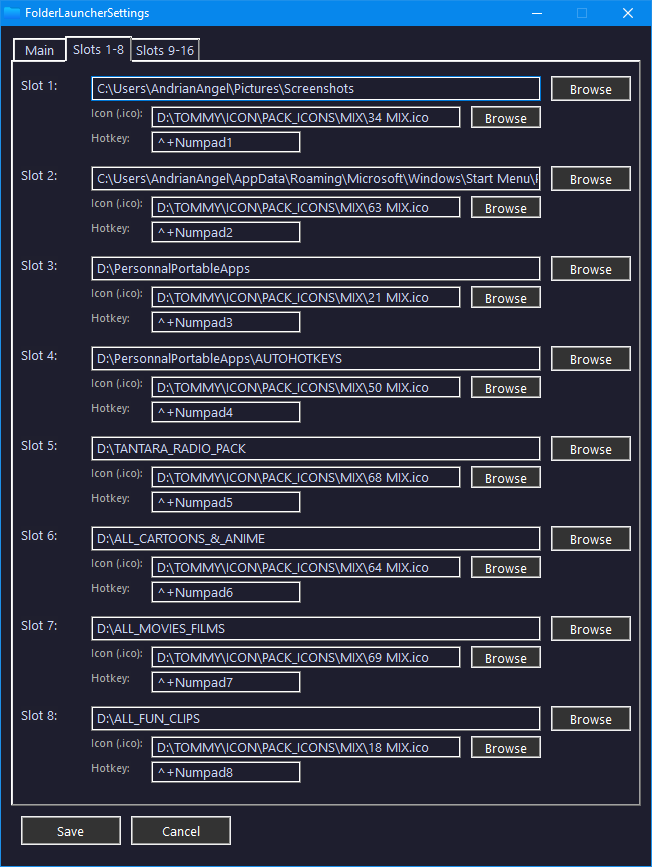
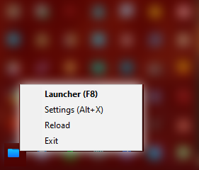
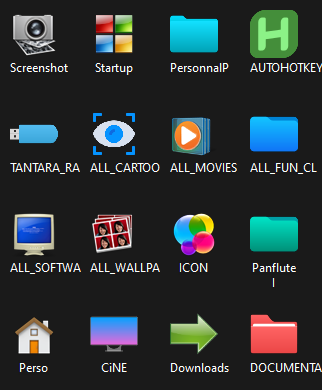
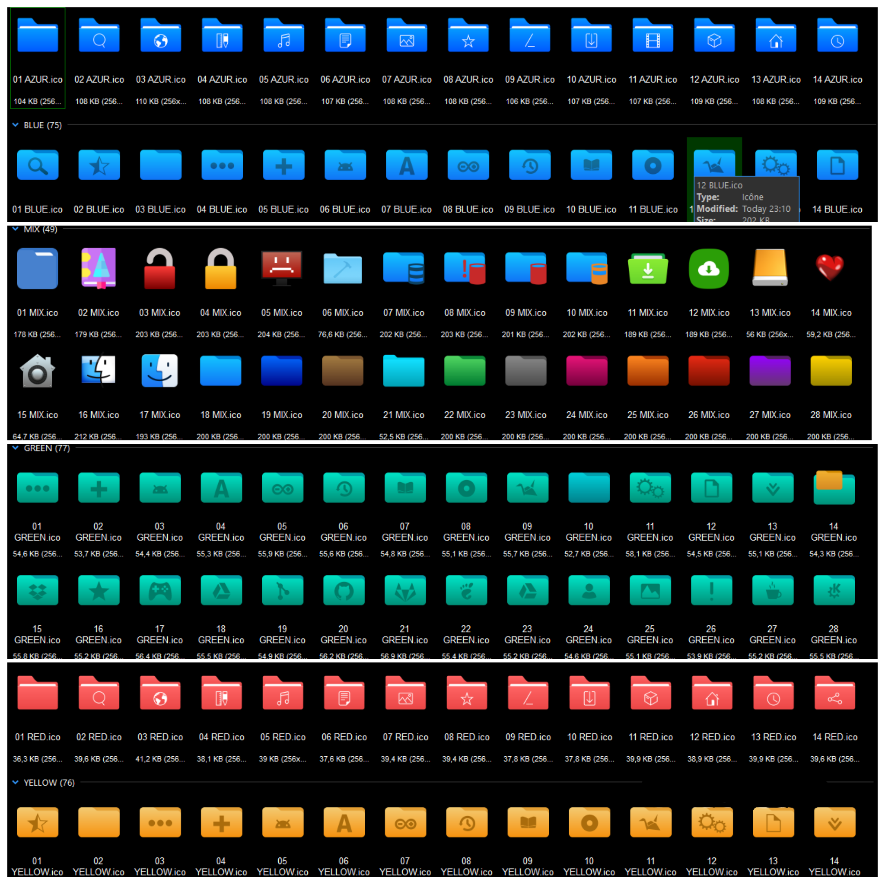

___

### 🗡️ MY FAVORITES FOLDERS LAUNCHER ULTIMATE
___

> A lightweight **AutoHotkey-powered** folder launcher for Windows.  
> Assign up to **16 favorite folders** to icon slots with custom icons and hotkeys — then launch them instantly from a sleek dark overlay or your system tray.

---

## 📥 Download

| Version | File |
|--------|------|
| ✅ Windows 64-bit | `MyFavoritesFolderLauncher_x64.exe` |
| ✅ Windows 32-bit | `MyFavoritesFolderLauncher_x86.exe` |
| 📦 ZIP (includes exe) | `MyFavoritesFolderLauncher_x64.zip` / `MyFavoritesFolderLauncher_x86.zip` |

> **No installation required.** Just extract and run. Settings are saved automatically in `FolderLauncherSettings.ini` next to the exe.

---

## ⚔️ Main Setting

Configure the core behavior of the launcher from the **Main tab** in Settings (`Alt+X`):

- ☑️ **Show Title Bar** — Toggle the title bar on the launcher overlay window
- ☑️ **Always open with Regular Windows File Explorer** — Force every folder to open in classic Explorer
- ☑️ **Use your default explorer + Ctrl+Click to force Windows Explorer** — Opens with your default file manager; hold `Ctrl` while clicking to override with Windows Explorer
- 🎹 **Settings Hotkey** — Customizable (default: `Alt+X`)
- 🎹 **Launcher Toggle Hotkey** — Customizable (default: `F8`)

> ⚠️ Choose **either** "Always Explorer" or "Ctrl+Click Explorer" — not both at the same time.

---

## 📜 SLOTS 1-8

Each slot (1–16, split across two tabs: **Slots 1-8** and **Slots 9-16**) supports:

- 📁 **Folder Path** — Browse or type the target folder path
- 🖼️ **Custom Icon** (`.ico`) — Browse to assign a personal icon per slot
- ⌨️ **Per-Slot Hotkey** — Assign an independent global hotkey to open that folder directly, even when the launcher is hidden

**Hotkey symbol reference:**

| Symbol | Key |
|--------|-----|
| `!` | Alt |
| `#` | Win |
| `^` | Ctrl |
| `+` | Shift |

> Example: `^!f` = `Ctrl+Alt+F`

---

## 📌 TRAY MENU

Right-click the system tray icon for quick access:

- **Launcher (F8)** — Open/close the folder grid overlay
- **Settings (Alt+X)** — Open the settings panel
- **Reload** — Restart the script to apply changes
- **Exit** — Close the application

---

## 🔗 LAUNCHER

Press `F8` (or your custom hotkey) to toggle the **4×4 folder grid overlay**:

- Displays up to **16 slots** in a compact dark-themed grid
- Each slot shows the folder's **custom icon** (or default folder icon) and a **short name label**
- **Click** a slot to open the folder with your default file manager
- **Ctrl+Click** a slot to force open with Windows File Explorer (if the option is enabled)
- Empty slots display a `+` placeholder with a prompt to assign a folder via Settings
- The overlay is **Always on Top** and closes automatically after opening a folder

---

_ 🎁 My Personal Set of Icons Packs (Bonus: PACK_ICONS.zip) 🙂

A bonus pack of custom `.ico` icons is included to personalize your slots.  
Extract `PACK_ICONS.zip` and browse to any icon from within the Settings panel.

---

## ⚙️ How It Works

1. Run the `.exe` — it starts silently in the system tray
2. Press `Alt+X` to open Settings and assign folders to slots
3. Optionally set a custom `.ico` icon and a hotkey per slot
4. Press `Save` — hotkeys activate immediately
5. Press `F8` to open the launcher grid and click any folder to launch it

---

## 📄 License

© AndrianAngel (Github) — All rights reserved.

